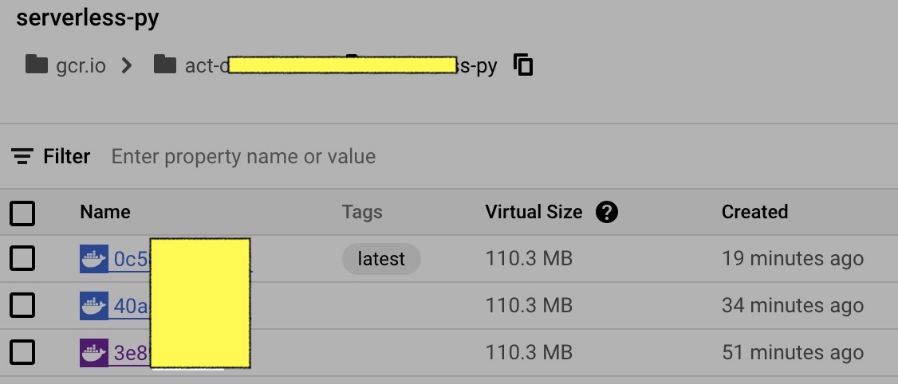
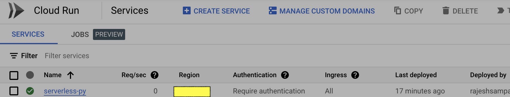

# serverless-py-app
This is a working example of Serverless offerings by GCP.

#### What's the big idea?
Share steps to incorporate Serverless resources like Cloud Run -> cloud Build to dockerize the app in order to host the web app - {Python app} in this case.

#### upcoming:
Plans to use Eventarc, Application Integrations, REST api calls and whatnot?

#### screen refs:

